# Guide d'utilisation NovaPartage

Ce guide décrit les parcours principaux de l'application : création d'un partage Excel, gestion des accès et remplissage d'un formulaire par un destinataire.

Pour l'installation et le déploiement, voir [INSTALL.md](INSTALL.md).

---

## Sommaire

1. [Page d'accueil publique](#1-page-daccueil-publique)
2. [Connexion à NovaPartage](#2-connexion-à-novapartage)
3. [Validation de l'email de connexion](#3-validation-de-lemail-de-connexion)
4. [Tableau de bord](#4-tableau-de-bord)
5. [Assistant de partage — étape 1 : fichier Excel](#5-assistant-de-partage--étape-1--fichier-excel)
6. [Assistant de partage — étape 2 : destinataires](#6-assistant-de-partage--étape-2--destinataires)
7. [Assistant de partage — étape 3 : cellules à remplir](#7-assistant-de-partage--étape-3--cellules-à-remplir)
8. [Assistant de partage — étape 4 : droits et finalisation](#8-assistant-de-partage--étape-4--droits-et-finalisation)
9. [Détails d'un partage](#9-détails-dun-partage)
10. [Tableau de bord (partages actifs)](#10-tableau-de-bord-partages-actifs)
11. [Invitation testeur — génération du lien](#11-invitation-testeur--génération-du-lien)
12. [Invitation testeur — inscription](#12-invitation-testeur--inscription)
13. [Espace testeur — tableau de bord](#13-espace-testeur--tableau-de-bord)
14. [Saisie des données (formulaire)](#14-saisie-des-données-formulaire)
15. [Validation d'un formulaire](#15-validation-dun-formulaire)

---

## 1. Page d'accueil publique

Accédez à la page d'accueil de l'application. Pour commencer rapidement, déposez votre fichier Excel dans la zone centrale. Si vous avez déjà un compte, cliquez sur **Mes partages** pour vous connecter.

Consultez les encarts en bas de page pour comprendre le fonctionnement de l'outil.

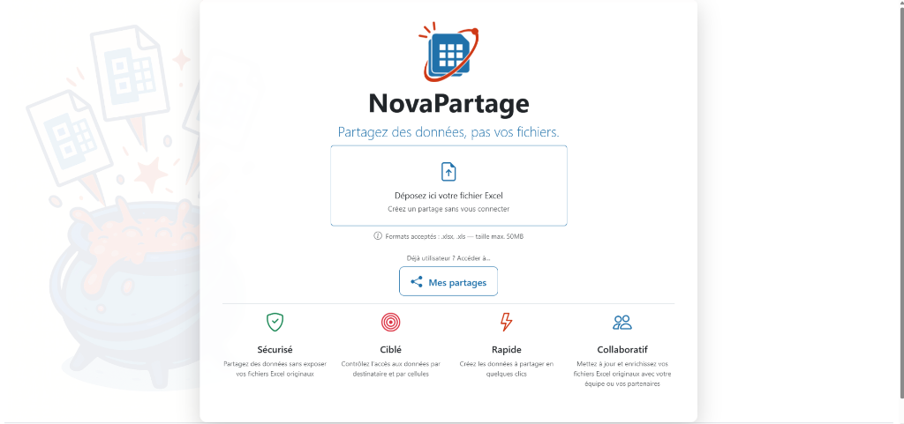

---

## 2. Connexion à NovaPartage

Saisissez votre adresse e-mail dans le champ prévu à cet effet. Cochez la case pour accepter les conditions d'utilisation et la politique de confidentialité, puis cliquez sur **Recevoir un lien de connexion**.

Un e-mail contenant un lien d'accès sécurisé vous sera envoyé. Cliquez sur ce lien dans votre messagerie pour vous connecter sans mot de passe.

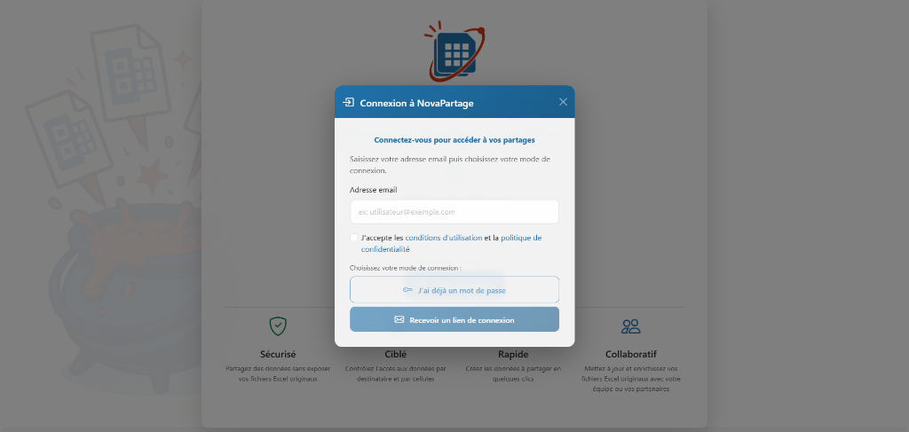

---

## 3. Validation de l'email de connexion

Ouvrez votre messagerie (en développement local : [Mailpit](http://localhost:8025)) et cliquez sur le lien **Se connecter à NovaPartage**.

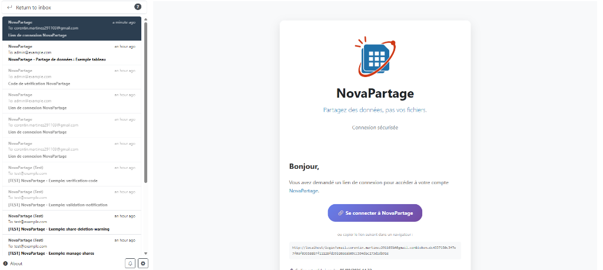

---

## 4. Tableau de bord

Consultez votre tableau de bord. Vérifiez vos compteurs globaux situés dans l'en-tête. S'il s'agit de votre première connexion, les listes de partages sont vides.

Cliquez sur **Créer un partage** (au centre) ou sur **Nouveau partage** (en haut à droite) pour lancer l'assistant de partage.

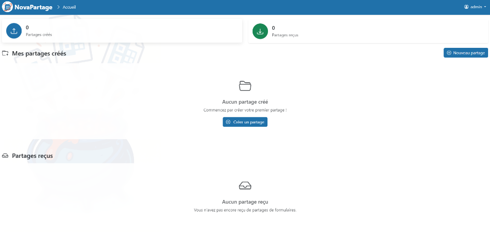

---

## 5. Assistant de partage — étape 1 : fichier Excel

Sélectionnez votre fichier Excel en cliquant sur la zone centrale ou en glissant-déposant le fichier directement dans cette zone.

Assurez-vous que la taille de votre fichier ne dépasse pas **50 Mo**. Cliquez sur **Suivant** pour continuer.

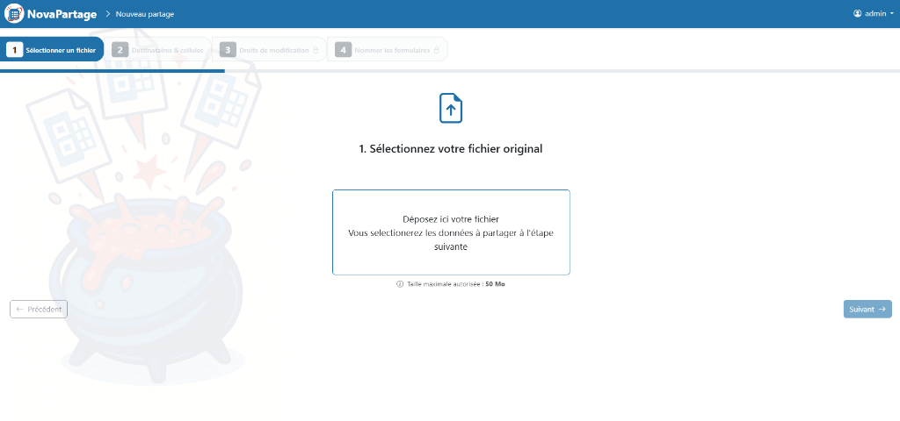

---

## 6. Assistant de partage — étape 2 : destinataires

Saisissez les adresses e-mail de vos collaborateurs dans la zone de texte, **une adresse par ligne**.

Consultez l'encart d'aide si vous avez un doute sur la syntaxe à utiliser. Vérifiez le nombre de destinataires ajoutés en bas de la zone de saisie, puis cliquez sur **Valider**.

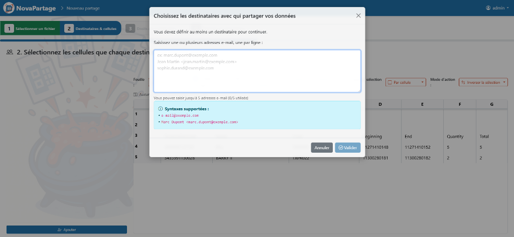

---

## 7. Assistant de partage — étape 3 : cellules à remplir

Cliquez dans le tableau pour sélectionner les cellules à attribuer au(x) destinataire(s), comme indiqué par le message d'aide, puis cliquez sur **Suivant**.

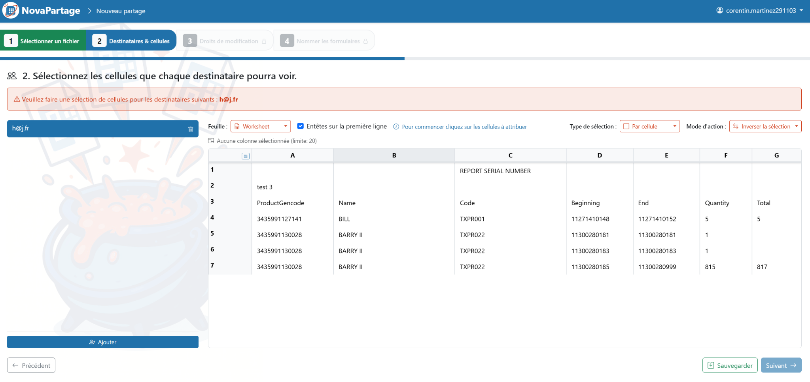

---

## 8. Assistant de partage — étape 4 : droits et finalisation

### Droits de modification

Sélectionnez dans le tableau les cellules que votre destinataire aura le droit de **modifier**, puis cliquez sur **Suivant**.

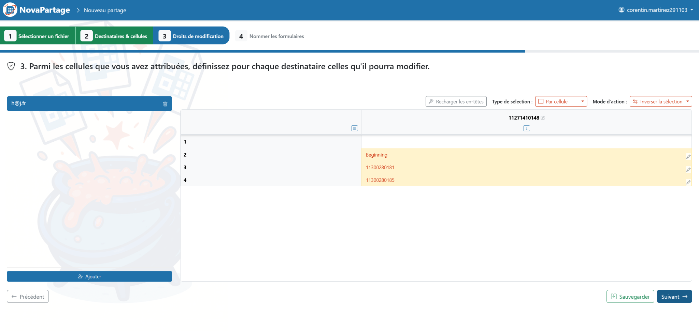

### Titre et envoi

Saisissez un titre clair pour ce partage. Cliquez sur **Appliquer à ce destinataire**, répétez pour chaque collaborateur, puis cliquez sur **Finaliser le partage** pour envoyer les accès.

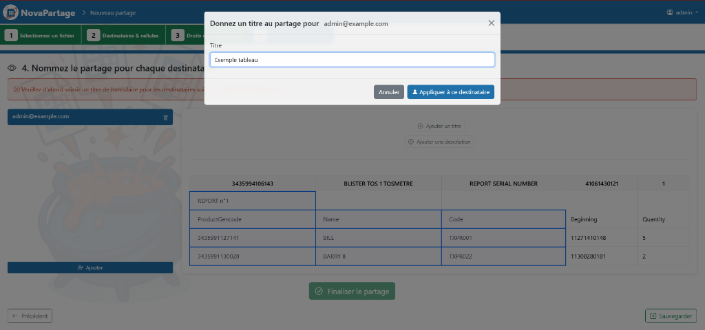

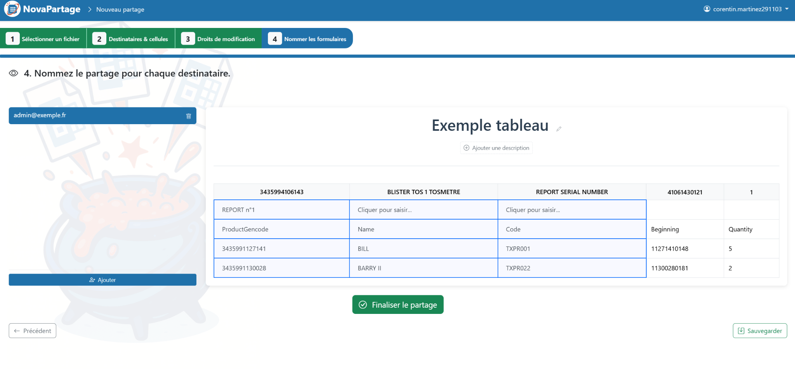

---

## 9. Détails d'un partage

Consultez le panneau de gauche pour voir la liste des personnes autorisées et le statut de leurs liens.

Utilisez les icônes d'action pour révoquer un accès ou copier un lien manuellement.

Dans le panneau de droite, vérifiez les informations du fichier d'origine. Vous pouvez **Télécharger le fichier original** ou **Supprimer le partage** pour tout annuler.

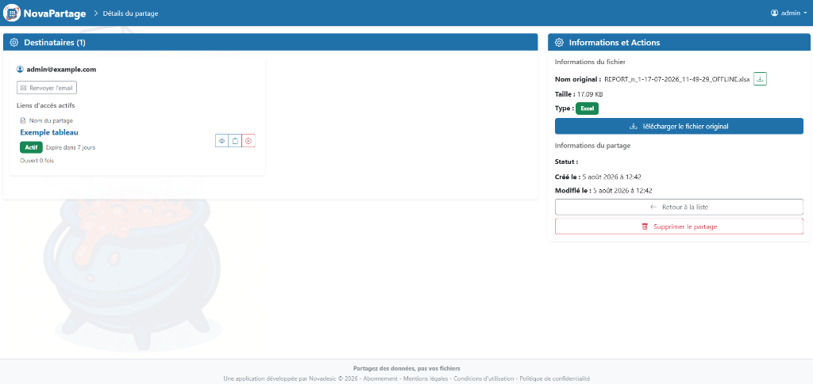

---

## 10. Tableau de bord (partages actifs)

Utilisez les cases à cocher au-dessus des tableaux pour filtrer vos partages.

- Dans **Mes partages créés** : cliquez sur l'icône en forme d'œil pour ouvrir les détails, ou sur la corbeille pour supprimer un partage.
- Dans **Partages reçus** : cliquez sur **Accéder** pour ouvrir un formulaire qui vous a été envoyé.

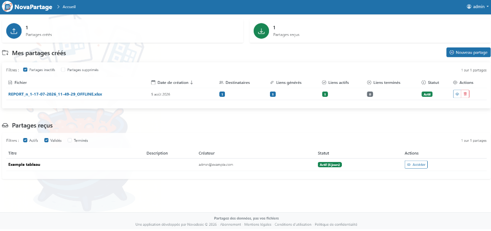

---

## 11. Invitation testeur — génération du lien

Accédez au menu de votre compte en haut à droite. Cliquez sur **Lien invitation testeur**. Dans la modale, cliquez sur **Générer un nouveau lien** pour créer une invitation unique.

Copiez ce lien sécurisé pour le transmettre à la personne que vous souhaitez inviter en tant que testeur.

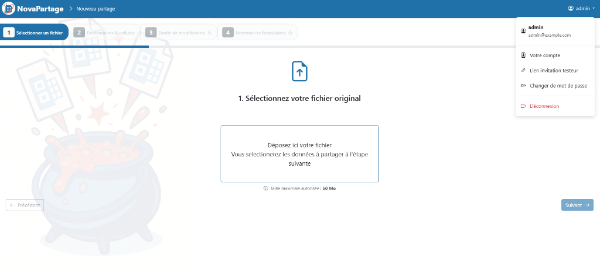

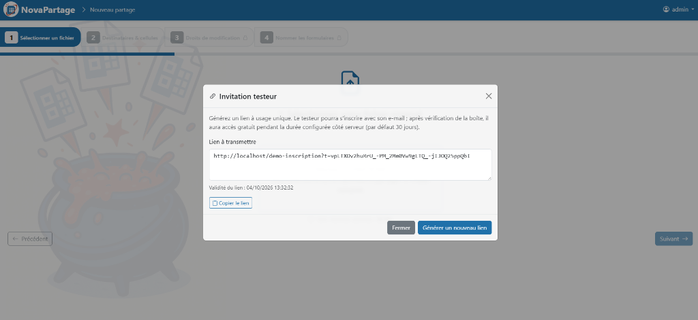

---

## 12. Invitation testeur — inscription

Ouvrez le lien d'invitation reçu. Renseignez votre adresse e-mail, puis cliquez sur **Continuer**. Un message de confirmation indique qu'un e-mail vous a été envoyé.

Consultez votre boîte mail et cliquez sur le lien **Se connecter à NovaPartage** pour valider votre inscription et activer votre période d'essai.

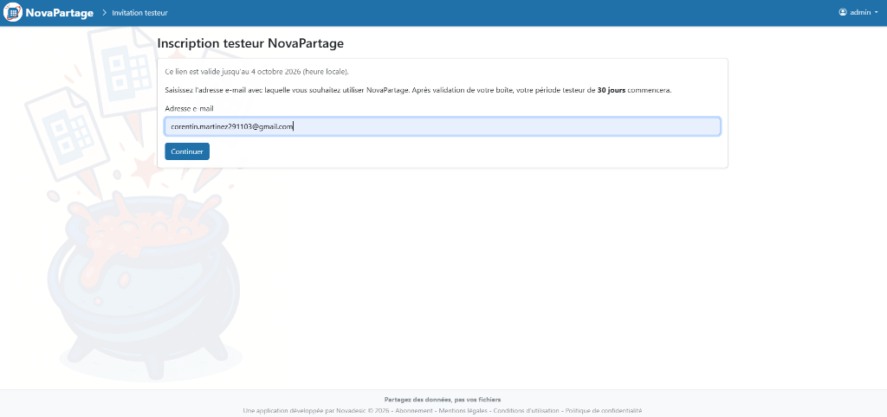

---

## 13. Espace testeur — tableau de bord

Connectez-vous à votre espace testeur. Le tableau de bord affiche l'ensemble des partages créés ou reçus.

S'il s'agit de votre première connexion, la liste est vide. Cliquez sur **Créer un partage** pour configurer votre premier fichier.

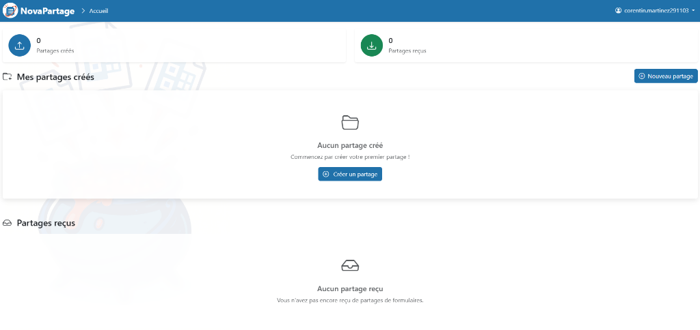

---

## 14. Saisie des données (formulaire)

Ouvrez le lien du formulaire qui vous a été partagé. L'interface affiche une grille contenant les cellules que vous devez remplir.

Cliquez sur les champs éditables pour saisir vos informations. Vous pouvez enregistrer vos progrès ou télécharger les données avant de valider.

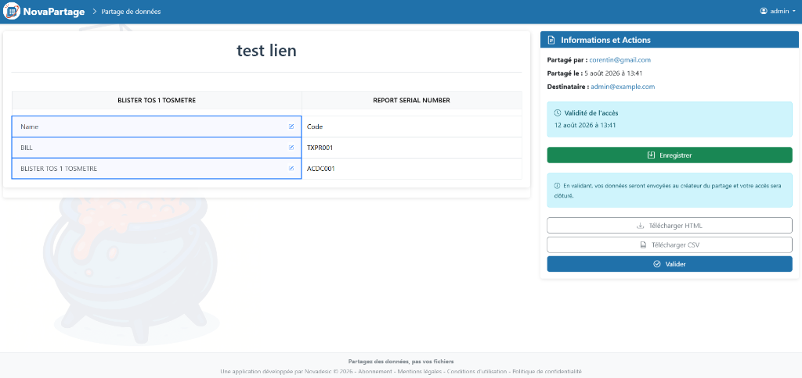

---

## 15. Validation d'un formulaire

Une fois vos saisies terminées, consultez le panneau de droite et cliquez sur **Valider**. Un message de confirmation s'affiche.

Ce message confirme que vos données ont bien été enregistrées, que l'accès au formulaire est clôturé et que le créateur du partage a été notifié.

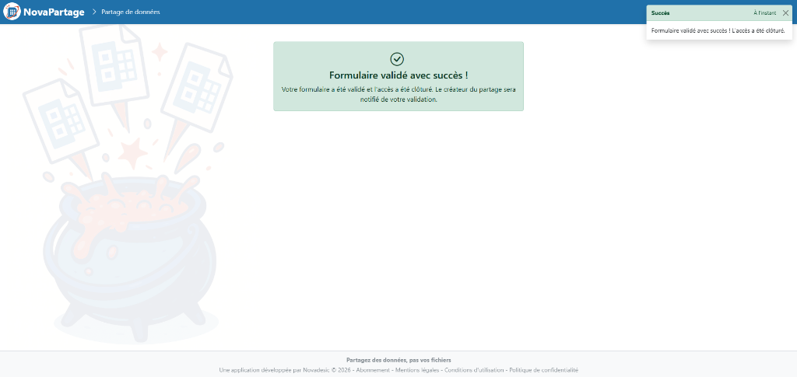
